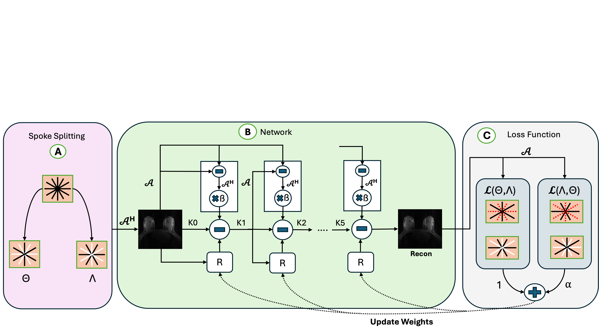

# RadRecon: Self-Supervised Radial MRI Reconstruction

## Overview
RadRecon is a self-supervised deep learning framework for multi-coil radial MRI reconstruction.  
It eliminates the need for fully sampled ground-truth data by leveraging a cross-consistency learning strategy on undersampled k-space data.

The framework builds on SSDU and introduces a **bidirectional spoke-splitting approach**, enabling reconstruction directly from real-world undersampled acquisitions.

## Key Contributions
- Self-supervised MRI reconstruction without fully sampled references  
- Cross-consistency learning using dual k-space subsets (ω, ε)  
- Physics-guided unrolled network (E2E VarNet style)  
- Integration of NUFFT and ESPIRiT-based coil sensitivity estimation  
- Stable reconstruction across multiple acceleration factors (R = 2, 4, 6, 8)

## Method

### Pipeline
k-space → NUFFT → Unrolled Network → Reconstructed Image

### Model
- Cascaded unrolled architecture (K = 5)
- U-Net based regularization
- Data Consistency (DC) enforced using MRI forward model
- Learnable DC weighting

### Self-Supervision
- Spoke-wise splitting: ω (training) and ε (validation)
- Cross-consistency loss:
  
  L_total = L(ω, ε) + λ L(ε, ω)

- Mixed L1 + L2 + SSIM loss for stable reconstruction

## Dataset
This project uses the **fastMRI Breast dataset**.

📥 Dataset link: https://fastmri.med.nyu.edu/

⚠️ Note:
The dataset is publicly available but **too large to include in this repository**.  

## Additional Details

For detailed usage instructions, see [Usage Guide](docs/usage.pdf)